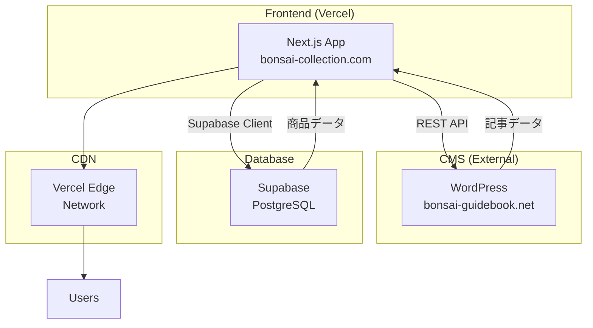
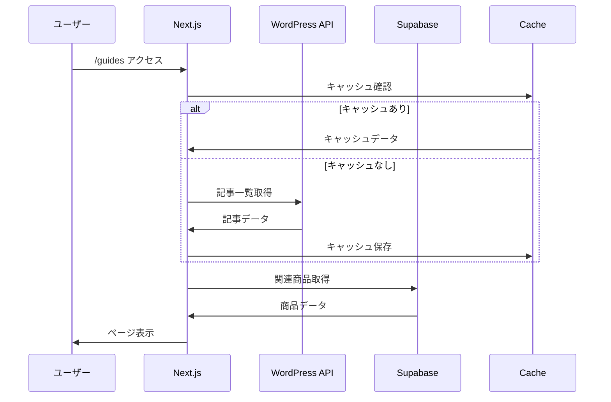

# 🏗️ ガイド記事統合プロジェクト - 基本設計書

## 1. システム構成

### 1.1 全体アーキテクチャ



### 1.2 データフロー



## 2. URL設計

### 2.1 ルーティング構造

| パス | 説明 | ページタイプ |
|------|------|------------|
| `/guides` | 記事一覧 | SSG + ISR |
| `/guides/[slug]` | 記事詳細 | SSG + ISR |
| `/guides/category/[category]` | カテゴリー別一覧 | SSG + ISR |
| `/guides/tag/[tag]` | タグ別一覧 | SSG + ISR |
| `/guides/search` | 検索結果 | CSR |

### 2.2 URLパラメータ

```
/guides?category=育て方&tag=初心者&sort=date-desc&page=2
```

| パラメータ | 値の例 | 説明 |
|-----------|--------|------|
| category | 育て方, 選び方 | カテゴリーフィルタ |
| tag | 初心者, 松 | タグフィルタ |
| sort | date-desc, date-asc, popular | 並び順 |
| page | 1, 2, 3... | ページ番号 |
| search | 水やり | 検索キーワード |

## 3. データモデル設計

### 3.1 記事データ（WordPress）

```typescript
interface Article {
  id: number
  slug: string
  title: {
    rendered: string
  }
  content: {
    rendered: string  // HTML
  }
  excerpt: {
    rendered: string
  }
  date: string
  modified: string
  featured_media: number
  categories: number[]
  tags: number[]
  author: number
  meta: {
    reading_time?: number
    views_count?: number
  }
  _embedded?: {
    'wp:featuredmedia': MediaObject[]
    'wp:term': Term[][]
    author: Author[]
  }
}

interface Category {
  id: number
  name: string
  slug: string
  description: string
  parent: number
  count: number
}

interface Tag {
  id: number
  name: string
  slug: string
  description: string
  count: number
}
```

### 3.2 商品データ（Supabase）

```typescript
interface Product {
  id: string
  name: string
  description: string
  price: number
  category: string
  size: 'small' | 'medium' | 'large'
  tags: string[]
  image_url: string
  amazon_url: string
  affiliate_tag: string
  stock_status: 'in_stock' | 'out_of_stock'
  created_at: string
  updated_at: string
}
```

### 3.3 関連性マッピング

```typescript
interface ArticleProductRelation {
  article_slug: string
  product_id: string
  relevance_score: number  // 0-100
  relation_type: 'tag_match' | 'category_match' | 'manual'
}
```

## 4. API設計

### 4.1 WordPress REST API エンドポイント

| エンドポイント | メソッド | 説明 |
|--------------|---------|------|
| `/wp-json/wp/v2/posts` | GET | 記事一覧取得 |
| `/wp-json/wp/v2/posts?slug={slug}` | GET | 記事詳細取得 |
| `/wp-json/wp/v2/categories` | GET | カテゴリー一覧 |
| `/wp-json/wp/v2/tags` | GET | タグ一覧 |
| `/wp-json/wp/v2/media/{id}` | GET | メディア取得 |

### 4.2 API レスポンスキャッシュ戦略

```typescript
// キャッシュ設定
const cacheConfig = {
  articles_list: {
    ttl: 3600,        // 1時間
    staleWhileRevalidate: 7200
  },
  article_detail: {
    ttl: 86400,       // 24時間
    staleWhileRevalidate: 172800
  },
  categories: {
    ttl: 604800       // 1週間
  },
  tags: {
    ttl: 604800       // 1週間
  }
}
```

## 5. コンポーネント設計

### 5.1 ページコンポーネント構造

```
src/app/guides/
├── layout.tsx              # ガイドセクションレイアウト
├── page.tsx               # 記事一覧ページ
├── [slug]/
│   └── page.tsx          # 記事詳細ページ
├── category/
│   └── [category]/
│       └── page.tsx      # カテゴリー別一覧
└── tag/
    └── [tag]/
        └── page.tsx      # タグ別一覧
```

### 5.2 共通コンポーネント

```
src/components/guides/
├── ArticleCard.tsx        # 記事カード
├── ArticleList.tsx        # 記事リスト
├── ArticleDetail.tsx      # 記事詳細表示
├── ArticleFilters.tsx     # フィルター UI
├── ArticleSearch.tsx      # 検索バー
├── CategoryNav.tsx        # カテゴリーナビ
├── TagCloud.tsx          # タグクラウド
├── RelatedProducts.tsx    # 関連商品
├── RelatedArticles.tsx    # 関連記事
├── TableOfContents.tsx    # 目次
└── ShareButtons.tsx       # SNSシェアボタン
```

### 5.3 コンポーネントインターフェース

```typescript
// ArticleCard
interface ArticleCardProps {
  article: Article
  variant?: 'default' | 'compact' | 'featured'
  showExcerpt?: boolean
  showTags?: boolean
}

// ArticleList
interface ArticleListProps {
  articles: Article[]
  layout?: 'grid' | 'list'
  columns?: 1 | 2 | 3 | 4
  showPagination?: boolean
  currentPage?: number
  totalPages?: number
  onPageChange?: (page: number) => void
}

// RelatedProducts
interface RelatedProductsProps {
  article: Article
  maxProducts?: number
  variant?: 'carousel' | 'grid'
}
```

## 6. 状態管理設計

### 6.1 状態管理方針

- **サーバー状態**: React Query (TanStack Query)
- **クライアント状態**: React useState/useContext
- **URL状態**: Next.js useSearchParams

### 6.2 状態管理フロー

```typescript
// React Query による記事データ管理
const useArticles = (params: ArticleParams) => {
  return useQuery({
    queryKey: ['articles', params],
    queryFn: () => fetchArticles(params),
    staleTime: 5 * 60 * 1000,  // 5分
    cacheTime: 10 * 60 * 1000,  // 10分
  })
}

// フィルター状態管理
const useArticleFilters = () => {
  const searchParams = useSearchParams()
  const router = useRouter()
  
  const filters = {
    category: searchParams.get('category'),
    tag: searchParams.get('tag'),
    sort: searchParams.get('sort') || 'date-desc',
    page: parseInt(searchParams.get('page') || '1')
  }
  
  const updateFilters = (newFilters: Partial<Filters>) => {
    const params = new URLSearchParams(searchParams)
    Object.entries(newFilters).forEach(([key, value]) => {
      if (value) params.set(key, value)
      else params.delete(key)
    })
    router.push(`/guides?${params.toString()}`)
  }
  
  return { filters, updateFilters }
}
```

## 7. SEO設計

### 7.1 メタデータ生成

```typescript
// 記事詳細ページのメタデータ
export async function generateMetadata({ params }): Promise<Metadata> {
  const article = await getArticle(params.slug)
  
  return {
    title: `${article.title} | 盆栽コレクション`,
    description: article.excerpt || article.title,
    keywords: article.tags.map(t => t.name).join(', '),
    openGraph: {
      title: article.title,
      description: article.excerpt,
      type: 'article',
      publishedTime: article.date,
      modifiedTime: article.modified,
      authors: [article.author.name],
      images: [article.featured_image],
    },
    twitter: {
      card: 'summary_large_image',
      title: article.title,
      description: article.excerpt,
      images: [article.featured_image],
    },
    alternates: {
      canonical: `https://bonsai-collection.com/guides/${params.slug}`,
    },
  }
}
```

### 7.2 構造化データ

```typescript
// Article Schema
const articleSchema = {
  '@context': 'https://schema.org',
  '@type': 'Article',
  headline: article.title,
  description: article.excerpt,
  image: article.featured_image,
  datePublished: article.date,
  dateModified: article.modified,
  author: {
    '@type': 'Person',
    name: article.author.name,
  },
  publisher: {
    '@type': 'Organization',
    name: '盆栽コレクション',
    logo: {
      '@type': 'ImageObject',
      url: 'https://bonsai-collection.com/logo.png',
    },
  },
  mainEntityOfPage: {
    '@type': 'WebPage',
    '@id': `https://bonsai-collection.com/guides/${article.slug}`,
  },
}
```

## 8. パフォーマンス設計

### 8.1 最適化戦略

| 手法 | 適用箇所 | 期待効果 |
|------|---------|---------|
| SSG | 記事詳細、カテゴリー一覧 | 初回表示高速化 |
| ISR | 記事一覧、人気記事 | 更新と速度の両立 |
| Image Optimization | アイキャッチ画像 | 画像サイズ最適化 |
| Lazy Loading | 記事本文内画像 | 初期表示高速化 |
| Code Splitting | ページ単位 | バンドルサイズ削減 |

### 8.2 キャッシュ戦略

```typescript
// Next.js の revalidate 設定
export const revalidate = 3600  // 1時間ごとに再生成

// WordPress API キャッシュ
const fetchWithCache = async (url: string) => {
  const cached = await cache.get(url)
  if (cached) return cached
  
  const response = await fetch(url)
  const data = await response.json()
  
  await cache.set(url, data, { ttl: 3600 })
  return data
}
```

## 9. エラーハンドリング設計

### 9.1 エラーケース

| エラー種別 | 原因 | 対処方法 |
|-----------|------|---------|
| WordPress API エラー | サーバーダウン、ネットワーク障害 | キャッシュ表示、エラーメッセージ |
| 記事が見つからない | 削除済み、スラッグ変更 | 404ページ、関連記事提案 |
| 画像読込エラー | リンク切れ、サーバーエラー | 代替画像表示 |
| 検索結果0件 | 該当記事なし | 提案キーワード表示 |

### 9.2 エラー処理実装

```typescript
// エラーバウンダリー
export function ArticleErrorBoundary({ 
  error, 
  reset 
}: {
  error: Error
  reset: () => void
}) {
  return (
    <div className="error-container">
      <h2>記事の読み込みに失敗しました</h2>
      <p>{error.message}</p>
      <button onClick={reset}>再試行</button>
    </div>
  )
}

// API エラーハンドリング
const fetchArticle = async (slug: string) => {
  try {
    const response = await fetch(`${API_URL}/posts?slug=${slug}`)
    if (!response.ok) {
      throw new Error(`記事の取得に失敗: ${response.status}`)
    }
    return await response.json()
  } catch (error) {
    console.error('Article fetch error:', error)
    // フォールバック: キャッシュから取得
    const cached = await getFromCache(`article-${slug}`)
    if (cached) return cached
    throw error
  }
}
```

## 10. テスト設計

### 10.1 テスト種別

| テスト種別 | 対象 | ツール |
|-----------|------|--------|
| 単体テスト | コンポーネント、関数 | Jest, React Testing Library |
| 統合テスト | API連携、ページ遷移 | Playwright |
| E2Eテスト | ユーザーシナリオ | Cypress |
| パフォーマンステスト | Core Web Vitals | Lighthouse CI |

### 10.2 テストケース例

```typescript
// 記事一覧取得テスト
describe('Articles API', () => {
  it('記事一覧を正常に取得できる', async () => {
    const articles = await fetchArticles({ page: 1 })
    expect(articles).toHaveLength(12)
    expect(articles[0]).toHaveProperty('title')
  })
  
  it('カテゴリーフィルターが機能する', async () => {
    const articles = await fetchArticles({ 
      category: '育て方' 
    })
    articles.forEach(article => {
      expect(article.categories).toContain('育て方')
    })
  })
})
```

---

**文書情報**
- バージョン: 1.0
- 作成日: 2024年
- 最終更新日: 2024年
- 次回レビュー予定: 実装開始時