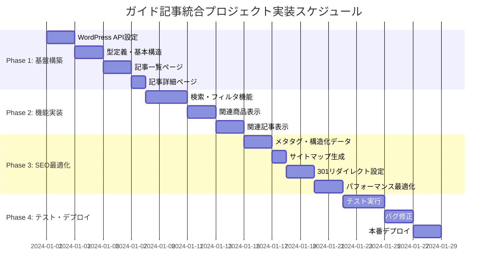
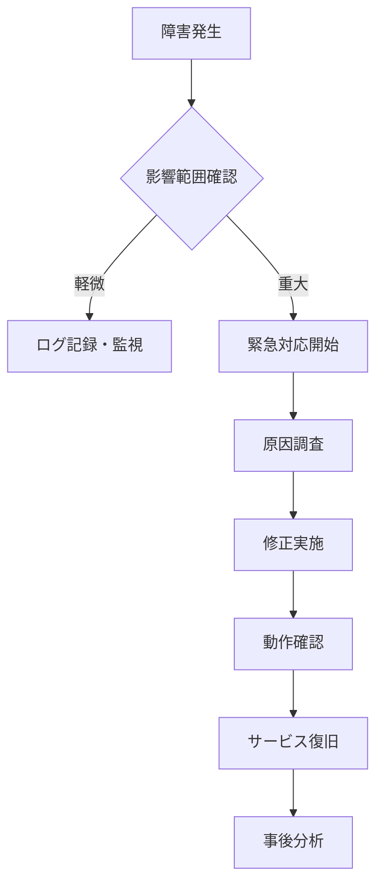
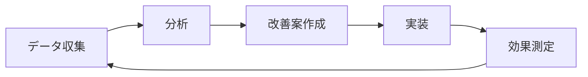

# 🚀 ガイド記事統合プロジェクト - 実装計画書

## 1. プロジェクトスケジュール

### 1.1 全体スケジュール（4週間）

| Phase | 期間 | 主要作業 | 成果物 |
|-------|------|---------|--------|
| **Phase 1** | Week 1 | 基盤構築 | WordPress API連携、基本ページ |
| **Phase 2** | Week 2 | 機能実装 | 検索・フィルタ、関連商品 |
| **Phase 3** | Week 3 | SEO最適化 | メタタグ、構造化データ |
| **Phase 4** | Week 4 | テスト・デプロイ | 本番リリース |

### 1.2 詳細スケジュール



## 2. Phase別実装計画

### 2.1 Phase 1: 基盤構築（Week 1）

#### 🎯 目標
WordPress記事を取得してNext.jsで表示する基本機能を実装

#### 📋 作業項目

**Day 1-2: WordPress API設定**
- [ ] WordPress REST API有効化確認
- [ ] APIエンドポイントテスト
- [ ] 認証設定（必要に応じて）
- [ ] CORS設定確認

```bash
# 作業コマンド例
curl "https://bonsai-guidebook.net/wp-json/wp/v2/posts?per_page=1"
curl "https://bonsai-guidebook.net/wp-json/wp/v2/categories"
curl "https://bonsai-guidebook.net/wp-json/wp/v2/tags"
```

**Day 3-4: 型定義・基本構造**
- [ ] TypeScript型定義作成
- [ ] WordPressAPIクライアント実装
- [ ] React Query設定
- [ ] 基本コンポーネント作成

**Day 5-6: 記事一覧ページ**
- [ ] `/guides` ページ作成
- [ ] 記事一覧取得・表示
- [ ] ページネーション実装
- [ ] レスポンシブ対応

**Day 7: 記事詳細ページ**
- [ ] `/guides/[slug]` ページ作成
- [ ] 記事詳細取得・表示
- [ ] 基本的なSEO設定

#### ✅ 完了基準
- WordPress記事がNext.jsで表示される
- 記事一覧・詳細ページが機能する
- モバイル対応完了

### 2.2 Phase 2: 機能実装（Week 2）

#### 🎯 目標
検索・フィルタ機能と記事-商品連携機能を実装

#### 📋 作業項目

**Day 1-3: 検索・フィルタ機能**
- [ ] カテゴリーフィルタ実装
- [ ] タグフィルタ実装
- [ ] フリーワード検索実装
- [ ] 並び替え機能実装
- [ ] URL状態管理実装

**Day 4-5: 関連商品表示**
- [ ] 商品関連付けロジック実装
- [ ] RelatedProductsコンポーネント作成
- [ ] 関連度計算アルゴリズム実装
- [ ] 商品カード表示

**Day 6-7: 関連記事表示**
- [ ] 関連記事ロジック実装
- [ ] RelatedArticlesコンポーネント作成
- [ ] 記事間の関連性計算
- [ ] UI/UX改善

#### ✅ 完了基準
- カテゴリー・タグによる絞り込みが機能
- 記事に関連商品が適切に表示される
- 関連記事が表示される

### 2.3 Phase 3: SEO最適化（Week 3）

#### 🎯 目標
検索エンジンからの流入を最大化するSEO機能を実装

#### 📋 作業項目

**Day 1-2: メタタグ・構造化データ**
- [ ] 動的メタタグ生成実装
- [ ] OpenGraph設定
- [ ] Twitter Card設定
- [ ] Article Schema実装
- [ ] BreadcrumbList Schema実装

**Day 3: サイトマップ生成**
- [ ] XMLサイトマップ自動生成
- [ ] 記事用サイトマップ作成
- [ ] Google Search Console登録

**Day 4-5: 301リダイレクト設定**
- [ ] 旧URLから新URLへのリダイレクト設定
- [ ] Vercelリダイレクト設定
- [ ] canonical URL設定

**Day 6-7: パフォーマンス最適化**
- [ ] 画像最適化実装
- [ ] コード分割実装
- [ ] キャッシュ戦略最適化
- [ ] Core Web Vitals改善

#### ✅ 完了基準
- Lighthouse SEOスコア90+
- Core Web Vitals全項目クリア
- 301リダイレクト正常動作

### 2.4 Phase 4: テスト・デプロイ（Week 4）

#### 🎯 目標
品質確保と本番環境でのスムーズな運用開始

#### 📋 作業項目

**Day 1-3: テスト実行**
- [ ] 単体テスト実行
- [ ] 統合テスト実行
- [ ] E2Eテスト実行
- [ ] パフォーマンステスト
- [ ] SEO検証

**Day 4-5: バグ修正**
- [ ] テストで発見されたバグの修正
- [ ] UI/UX改善
- [ ] パフォーマンス調整

**Day 6-7: 本番デプロイ**
- [ ] ステージング環境での最終確認
- [ ] 本番デプロイ
- [ ] モニタリング設定
- [ ] 運用開始

#### ✅ 完了基準
- 全テストパス
- 本番環境正常稼働
- モニタリング設定完了

## 3. 技術実装詳細

### 3.1 開発環境セットアップ

```bash
# 1. 必要パッケージのインストール
npm install @tanstack/react-query
npm install @types/wordpress__api-fetch
npm install next-sitemap
npm install -D @testing-library/react @testing-library/jest-dom

# 2. 環境変数設定
echo "WORDPRESS_API_URL=https://bonsai-guidebook.net/wp-json/wp/v2" >> .env.local
echo "NEXT_PUBLIC_SITE_URL=https://bonsai-collection.com" >> .env.local

# 3. TypeScript設定確認
npx tsc --noEmit
```

### 3.2 ファイル作成順序

#### Week 1: 基盤ファイル
1. `types/wordpress.ts` - 型定義
2. `lib/wordpress/api.ts` - API クライアント
3. `lib/hooks/useArticles.ts` - React Query フック
4. `app/guides/layout.tsx` - レイアウト
5. `app/guides/page.tsx` - 一覧ページ
6. `app/guides/[slug]/page.tsx` - 詳細ページ

#### Week 2: 機能コンポーネント
1. `components/features/guides/ArticleCard.tsx`
2. `components/features/guides/ArticleList.tsx`
3. `components/features/guides/ArticleFilters.tsx`
4. `components/features/guides/RelatedProducts.tsx`
5. `components/features/guides/RelatedArticles.tsx`

#### Week 3: SEO・最適化
1. `components/seo/StructuredData.tsx`
2. `app/sitemap.xml/route.ts`
3. `next.config.js` - リダイレクト設定
4. `components/ui/OptimizedImage.tsx`

### 3.3 API統合テスト

```typescript
// tests/wordpress-api.test.ts
describe('WordPress API Integration', () => {
  test('記事一覧取得', async () => {
    const result = await wordpressAPI.fetchArticles({ page: 1 })
    expect(result.articles).toHaveLength(12)
    expect(result.totalPages).toBeGreaterThan(0)
  })

  test('記事詳細取得', async () => {
    const article = await wordpressAPI.fetchArticleBySlug('test-article')
    expect(article).toBeDefined()
    expect(article?.title).toBeTruthy()
  })

  test('カテゴリー取得', async () => {
    const categories = await wordpressAPI.fetchCategories()
    expect(categories.length).toBeGreaterThan(0)
  })
})
```

## 4. 品質管理

### 4.1 コードレビューチェックリスト

#### 機能実装
- [ ] TypeScript型定義が適切
- [ ] エラーハンドリングが実装されている
- [ ] ローディング状態が適切に表示される
- [ ] レスポンシブ対応されている
- [ ] アクセシビリティ要件を満たしている

#### パフォーマンス
- [ ] 不要な再レンダリングが発生していない
- [ ] 画像が最適化されている
- [ ] バンドルサイズが適切
- [ ] キャッシュ戦略が適切

#### SEO
- [ ] メタタグが動的生成されている
- [ ] 構造化データが実装されている
- [ ] URLが SEO フレンドリー
- [ ] サイトマップが生成されている

### 4.2 テスト戦略

| テスト種別 | 対象 | 実行タイミング |
|-----------|------|--------------|
| **Unit Test** | 関数・コンポーネント | 開発中 |
| **Integration Test** | API連携 | 機能完成時 |
| **E2E Test** | ユーザーシナリオ | デプロイ前 |
| **Performance Test** | Core Web Vitals | 最適化後 |
| **SEO Test** | メタデータ・構造化データ | SEO実装後 |

### 4.3 デプロイメント戦略

```yaml
# .github/workflows/deploy.yml
name: Deploy to Vercel
on:
  push:
    branches: [main]
  pull_request:
    branches: [main]

jobs:
  test:
    runs-on: ubuntu-latest
    steps:
      - uses: actions/checkout@v3
      - name: Setup Node.js
        uses: actions/setup-node@v3
        with:
          node-version: '18'
      - name: Install dependencies
        run: npm ci
      - name: Run tests
        run: npm test
      - name: Build
        run: npm run build
      - name: Run E2E tests
        run: npm run test:e2e

  deploy:
    needs: test
    if: github.ref == 'refs/heads/main'
    runs-on: ubuntu-latest
    steps:
      - uses: actions/checkout@v3
      - name: Deploy to Vercel
        uses: vercel/action@v1
        with:
          vercel-token: ${{ secrets.VERCEL_TOKEN }}
          vercel-org-id: ${{ secrets.ORG_ID }}
          vercel-project-id: ${{ secrets.PROJECT_ID }}
```

## 5. リスク管理

### 5.1 技術リスク

| リスク | 影響度 | 対策 |
|--------|--------|------|
| **WordPress API障害** | 高 | キャッシュ機能、フォールバック |
| **パフォーマンス劣化** | 中 | 段階的最適化、モニタリング |
| **SEO順位低下** | 高 | 段階的移行、リダイレクト |
| **依存関係の問題** | 低 | バージョン固定、テスト |

### 5.2 スケジュールリスク

| リスク | 確率 | 対策 |
|--------|------|------|
| **機能実装の遅延** | 中 | MVP優先、段階的リリース |
| **テスト期間不足** | 低 | 並行テスト、自動化 |
| **WordPress連携の問題** | 低 | 早期検証、代替案準備 |

### 5.3 運用リスク

| リスク | 対策 |
|--------|------|
| **記事編集者の混乱** | 操作マニュアル作成、研修実施 |
| **記事データの不整合** | バックアップ、データ検証 |
| **アクセス急増** | CDN活用、スケーリング対応 |

## 6. 運用・保守計画

### 6.1 監視項目

| 項目 | 監視ツール | アラート条件 |
|------|-----------|------------|
| **サイト稼働率** | Vercel Analytics | 99%未満 |
| **ページ応答時間** | Lighthouse CI | 2秒超過 |
| **エラー率** | Sentry | 1%超過 |
| **API応答時間** | カスタム監視 | 500ms超過 |

### 6.2 定期メンテナンス

| 頻度 | 作業内容 |
|------|---------|
| **日次** | エラーログ確認、パフォーマンス確認 |
| **週次** | 依存関係更新、セキュリティチェック |
| **月次** | SEO分析、機能改善検討 |
| **四半期** | 大型アップデート、戦略見直し |

### 6.3 緊急時対応



## 7. 成功指標とKPI

### 7.1 技術指標

| 指標 | 目標値 | 測定方法 |
|------|--------|---------|
| **Lighthouse Performance** | 90+ | Lighthouse CI |
| **Lighthouse SEO** | 95+ | Lighthouse CI |
| **Core Web Vitals** | All Good | Search Console |
| **API応答時間** | <500ms | Vercel Analytics |

### 7.2 ビジネス指標

| 指標 | 3ヶ月目標 | 6ヶ月目標 |
|------|-----------|-----------|
| **オーガニック流入** | 5,000 PV/月 | 20,000 PV/月 |
| **記事→商品CTR** | 10% | 15% |
| **セッション時間** | 3分 | 4分 |
| **直帰率** | 60%以下 | 50%以下 |

### 7.3 改善サイクル



## 8. ドキュメント管理

### 8.1 作成ドキュメント

- [x] 要件定義書
- [x] 基本設計書
- [x] 技術仕様書
- [x] 実装計画書
- [ ] 運用マニュアル
- [ ] トラブルシューティングガイド

### 8.2 更新スケジュール

| ドキュメント | 更新頻度 | 責任者 |
|-------------|---------|--------|
| 実装計画書 | 週次 | 開発者 |
| 運用マニュアル | 月次 | 運用者 |
| 技術仕様書 | 機能追加時 | 開発者 |

---

**文書情報**
- バージョン: 1.0
- 作成日: 2024年
- 最終更新日: 2024年
- 承認者: 
- 次回レビュー予定: Phase 1完了時

**関連ドキュメント**
- [要件定義書](./GUIDES_INTEGRATION_REQUIREMENTS.md)
- [基本設計書](./GUIDES_BASIC_DESIGN.md)
- [技術仕様書](./GUIDES_TECHNICAL_SPECIFICATION.md)