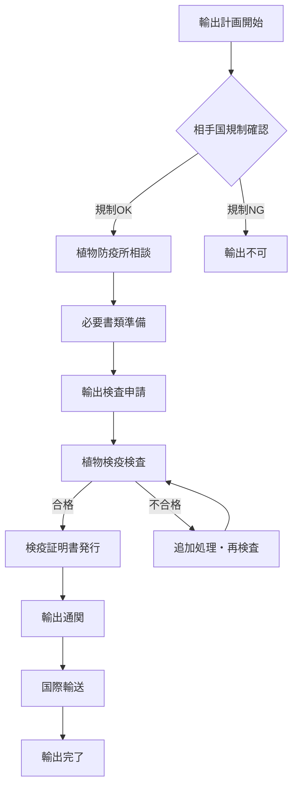

# 盆栽の国際輸出入ガイド｜検疫・法規制・手続き完全解説

グローバル化が進む現代、盆栽の国際取引も活発になっています。しかし、植物の国際移動には厳格な検疫制度と複雑な法規制が存在します。本ガイドでは、盆栽の輸出入に関する法的要件、手続き、実務的なノウハウを詳しく解説し、安全で確実な国際取引を実現するための知識を提供します。

## 国際植物検疫制度の基本

### 植物検疫の目的と重要性

**植物検疫の基本目的：**
- **病害虫防除**: 外来有害生物の侵入防止
- **生態系保護**: 在来生態系の保護
- **農業保護**: 農作物への被害防止
- **生物多様性維持**: 固有種の保護

**国際的な枠組み：**
- **IPPC**: 国際植物防疫条約
- **ISPM**: 国際植物検疫措置基準
- **CITES**: ワシントン条約（絶滅危惧種）
- **CBD**: 生物多様性条約

### 主要国の植物検疫制度

| 国・地域 | 管轄機関 | 主要法令 | 特徴・注意点 | 事前許可 |
|---------|---------|----------|-------------|----------|
| **日本** | 農林水産省<br>植物防疫所 | 植物防疫法 | • 土壌付着OK（一部制限）<br>• 検疫期間：3-7日 | 輸入許可証 |
| **アメリカ** | USDA-APHIS | CFR Title 7 | • 土壌完全除去必須<br>• 州別追加規制あり | Import Permit<br>必須 |
| **EU諸国** | 各国防疫機関 | EU規則<br>2016/2031 | • 植物パスポート制度<br>• 域内移動は簡易 | Phytosanitary<br>Certificate |
| **オーストラリア** | DAWE | Biosecurity Act | • 極めて厳格な規制<br>• 検疫期間長期 | Import Permit<br>+ 事前審査 |
| **カナダ** | CFIA | Plant Protection Act | • アメリカ準拠<br>• 州政府規制併存 | Permit to Import |

> **💡 ポイント**: 各国の規制は頻繁に変更されるため、輸出入前には必ず最新情報を確認してください。
- **第三国輸入**: 統一された輸入要件

**オーストラリア（DAFF）：**
- **管轄**: 農業・漁業・林業省
- **特徴**: 世界で最も厳格な検疫
- **隔離検疫**: 必須の隔離期間
- **土壌禁止**: 土壌付着植物は原則禁止

## 輸出手続きの詳細

### 日本からの輸出手続き

### 📋 輸出手続きフローチャート



**⏱️ 所要期間**: 準備から輸出まで **2-4週間**

### 📝 必要書類チェックリスト

| 書類名 | 発行者 | 必須度 | 備考 |
|--------|--------|--------|------|
| ✅ 輸出検査申請書 | 申請者 | 必須 | 植物防疫所指定様式 |
| ✅ Invoice（送り状） | 申請者 | 必須 | 商業価値記載 |
| ✅ Packing List | 申請者 | 必須 | 梱包明細書 |
| ✅ 輸入許可書 | 相手国政府 | 国による | Import Permit |
| ✅ CITES許可書 | 経済産業省 | 該当種のみ | ワシントン条約対象 |

> **⚠️ 注意**: 書類不備は輸出遅延の主要因です。事前確認を徹底してください。

**植物検疫検査の内容：**
- **外観検査**: 病害虫の有無
- **書類審査**: 申請内容との照合
- **必要に応じた**: 精密検査・薬剤処理
- **証明書発行**: Phytosanitary Certificate

**検査場所と所要時間：**
- **指定場所**: 植物防疫所・支所
- **事前予約**: 検査日時の予約必要
- **所要時間**: 通常1-3営業日
- **急送検査**: 追加料金で当日検査可能

### 輸出時の特別要件

### 🌱 土壌処理の手順

| ステップ | 作業内容 | 所要時間 | 注意点 |
|----------|----------|----------|--------|
| **1. 事前準備** | 植物の健康状態確認 | 30分 | 弱った植物は避ける |
| **2. 土壌除去** | 根の土壌を完全除去 | 2-3時間 | 根を傷つけないよう注意 |
| **3. 洗浄** | 根部の徹底洗浄 | 1時間 | 清潔な水で3回以上 |
| **4. 代替培地** | 無菌培地への植え替え | 1時間 | ピートモス+バーミキュライト |
| **5. 検査準備** | 検疫検査用の整備 | 30分 | ラベル付け・書類準備 |

### 💉 薬剤処理オプション

```
🔸 燻蒸処理 (Fumigation)
  └─ 臭化メチル 16g/m³ × 2時間 (20℃)
  └─ 効果：広範囲の病害虫駆除
  └─ 費用：5,000-15,000円

🔸 温水処理 (Hot Water Treatment)
  └─ 45℃ × 30分間
  └─ 効果：線虫・ダニ類駆除
  └─ 費用：3,000-8,000円

🔸 薬剤散布 (Chemical Treatment)
  └─ 指定殺虫剤・殺菌剤
  └─ 効果：表面病害虫駆除
  └─ 費用：2,000-5,000円
```

**特殊な樹種への対応：**
- **CITES該当種**: 絶滅危惧種の特別許可
- **在来種保護**: 輸出禁止種の確認
- **品種登録**: 育成者権の確認
- **遺伝資源**: ABS議定書への対応

## 輸入手続きの詳細

### 日本への輸入手続き

**基本的な流れ：**
```
1. 植物防疫所への事前相談
2. 輸入許可申請（必要な場合）
3. 海外での輸出検査
4. 日本到着・輸入検査
5. 検査合格・検疫証明
6. 税関手続き
7. 国内搬入
```

**輸入禁止・制限植物：**
- **輸入禁止**: 法令で禁止された植物
- **輸入許可制**: 事前許可が必要な植物
- **指定地域**: 特定地域からの輸入禁止
- **検疫有害動植物**: 寄主植物の制限

**輸入検査の内容：**
- **書類検査**: 植物検疫証明書等の確認
- **外観検査**: 病害虫の有無確認
- **精密検査**: 必要に応じた詳細検査
- **隔離検疫**: 一定期間の隔離検査

**検疫措置：**
- **消毒**: 薬剤による消毒処理
- **廃棄**: 検査不合格品の廃棄
- **返送**: 輸出国への返送
- **条件付合格**: 条件付での輸入許可

## 主要国別の輸入要件

### アメリカ向け輸出

**基本要件：**
- **Import Permit**: 事前輸入許可必須
- **申請先**: USDA-APHIS
- **処理期間**: 2-8週間
- **有効期間**: 3年間（更新可能）

**特殊要件：**
- **土壌除去**: 完全な土壌除去必須
- **根部処理**: 根の洗浄・乾燥
- **薬剤処理**: 指定薬剤による処理
- **梱包要件**: 清潔な梱包材使用

**州別追加規制：**
- **カリフォルニア州**: 追加検査・許可
- **フロリダ州**: 柑橘類関連規制
- **ハワイ州**: 独自の検疫制度
- **その他州**: 各州の規制確認必要

### EU向け輸出

**基本要件：**
- **植物パスポート**: EU域内での植物パスポート
- **事前通告**: 到着24時間前までの通告
- **指定港**: 指定された輸入港のみ
- **検査料**: 国別の検査料金

**特殊要件：**
- **害虫リスト**: EU指定有害生物リスト
- **原産地証明**: 植物の原産地証明
- **栽培地検査**: 栽培地での事前検査
- **追跡可能性**: 生産履歴の記録

**主要国別の特徴：**
- **ドイツ**: 厳格な書類審査
- **オランダ**: 流通拠点として重要
- **イタリア**: 地中海性植物の規制
- **フランス**: ワイン関連植物の制限

### オーストラリア向け輸出

**基本要件：**
- **Import Permit**: 絶対必須
- **申請**: DAFF（農業・漁業・林業省）
- **処理期間**: 4-12週間
- **更新**: 定期的な更新必要

**厳格な規制：**
- **土壌完全除去**: 土壌・有機物完全除去
- **隔離検疫**: 30-90日間の隔離
- **検疫施設**: 指定検疫施設での管理
- **高額費用**: 隔離・検査費用

**特殊処理要件：**
- **燻蒸処理**: 必須の燻蒸処理
- **温水処理**: 根部の温水処理
- **薬剤散布**: 指定薬剤による処理
- **包装要件**: 新品梱包材のみ使用

## 梱包・輸送の実務

### 適切な梱包方法

**基本原則：**
- **生存確保**: 輸送中の植物の生存
- **病害虫防止**: 病害虫の混入防止
- **法規遵守**: 各国規制への適合
- **損傷防止**: 物理的損傷の防止

**梱包材料の選択：**
- **鉢の代替**: プラスチック鉢・紙鉢
- **培地**: 無菌培地・人工土壌
- **包装材**: 新品・清潔な材料
- **緩衝材**: 植物に無害な緩衝材

**具体的梱包手順：**

**1. 植物の準備**
```
土壌除去 → 根部洗浄 → 乾燥 → 薬剤処理
```

**2. 培地の準備**
```
無菌培地調製 → 適度な湿度 → 清潔容器
```

**3. 梱包作業**
```
植物固定 → 培地充填 → 容器密封 → 表示
```

**4. 外装梱包**
```
緩衝材 → 外装箱 → 表示ラベル → 書類添付
```

### 国際輸送の選択

**輸送手段の比較：**

**航空便（Air Cargo）:**
- **利点**: 速達・生存率高い
- **欠点**: 高額・重量制限
- **所要時間**: 1-3日
- **適用**: 高価値品・緊急品

**船便（Sea Freight）:**
- **利点**: 低コスト・大量輸送
- **欠点**: 長期間・リスク高
- **所要時間**: 1-4週間
- **適用**: 大量輸送・コスト重視

**国際宅配便（Express）:**
- **利点**: 簡便・追跡可能
- **欠点**: 制限多い・中程度コスト
- **所要時間**: 2-5日
- **適用**: 小口・個人向け

### 輸送中のリスク管理

**主要リスク：**
- **温度変化**: 極端な温度による損傷
- **湿度変化**: 乾燥・過湿による枯死
- **物理的衝撃**: 落下・圧迫による損傷
- **遅延**: 予期しない輸送遅延

**リスク軽減策：**
- **温度管理**: 断熱材・保冷剤使用
- **湿度制御**: 湿度調整剤・密封
- **衝撃防止**: 十分な緩衝材
- **追跡**: リアルタイム追跡サービス

## 法的リスクと対策

### 主要な法的リスク

**検疫違反：**
- **無許可輸入**: 許可なしでの輸入
- **虚偽申告**: 不正確な申告内容
- **検疫回避**: 検疫手続きの回避
- **処罰**: 罰金・没収・刑事処分

**CITES違反：**
- **無許可取引**: 許可なしでの取引
- **該当種の見落とし**: 規制種の確認不足
- **書類不備**: 必要書類の不備
- **処罰**: 重い刑事処分

**知的財産権侵害：**
- **品種権**: 育成者権の侵害
- **商標権**: 商標の無断使用
- **著作権**: 写真・文章の無断使用
- **処罰**: 民事・刑事責任

### リスク回避策

**事前確認の徹底：**
- **法規制調査**: 最新規制の確認
- **専門家相談**: 専門業者への相談
- **官庁確認**: 管轄官庁への直接確認
- **定期更新**: 規制変更の定期確認

**適切な書類管理：**
- **正確な記載**: 申告内容の正確性
- **完全な書類**: 必要書類の完備
- **保管義務**: 法定保管期間の遵守
- **複写保存**: 重要書類の複写保存

**保険の活用：**
- **貨物保険**: 輸送中の損害保険
- **PL保険**: 生産物賠償責任保険
- **法律費用保険**: 法的紛争費用保険
- **事業中断保険**: 事業中断リスク保険

## 実務的なノウハウ

### 成功する輸出入のコツ

**計画段階：**
- **早期準備**: 十分な準備期間確保
- **季節考慮**: 植物に適した季節選択
- **リスク評価**: 総合的なリスク評価
- **代替案**: 複数の選択肢準備

**実行段階：**
- **品質管理**: 最高品質での出荷
- **コミュニケーション**: 関係者との密な連絡
- **柔軟対応**: 予期しない事態への対応
- **記録保持**: 詳細な記録の保持

**アフターケア：**
- **着荷確認**: 到着状況の確認
- **フォローアップ**: 定着状況の確認
- **関係維持**: 長期的な関係構築
- **改善**: 次回への改善点抽出

### よくある失敗とその対策

**書類不備による失敗：**
- **原因**: 申請書類の記載ミス
- **対策**: 複数人での書類チェック
- **予防**: テンプレートの活用
- **復旧**: 迅速な修正対応

**梱包不備による損失：**
- **原因**: 不適切な梱包方法
- **対策**: 専門業者への委託
- **予防**: 梱包基準の標準化
- **復旧**: 保険請求・代替品送付

**規制変更への対応遅れ：**
- **原因**: 最新情報の把握不足
- **対策**: 定期的な情報収集
- **予防**: 専門機関との関係構築
- **復旧**: 緊急時の専門家相談

## デジタル化と将来展望

### 電子申請システム

**各国の電子化状況：**
- **日本**: NACCS（輸出入・港湾関連情報処理システム）
- **アメリカ**: ePermits（電子許可システム）
- **EU**: TRACES（動植物衛生システム）
- **オーストラリア**: BICON（生物安全輸入条件システム）

**電子化のメリット：**
- **効率化**: 手続き時間の短縮
- **正確性**: 入力ミスの削減
- **透明性**: 進捗状況の可視化
- **コスト削減**: 事務コストの削減

### ブロックチェーン活用

**期待される応用：**
- **トレーサビリティ**: 生産から流通まで追跡
- **真正性証明**: 偽造防止・品質保証
- **スマートコントラクト**: 自動契約執行
- **国際連携**: 国境を越えた情報共有

### AI・IoT技術

**検疫業務の革新：**
- **画像認識**: AI による病害虫検出
- **センサー技術**: リアルタイム品質監視
- **予測分析**: リスク予測・早期警告
- **自動化**: 検査工程の自動化

## まとめ

盆栽の国際輸出入は複雑な手続きを要しますが、適切な知識と準備により安全で確実な取引が可能です。グローバル化が進む現代において、国際的な盆栽文化の交流は今後ますます重要になるでしょう。

**成功のポイント：**
1. **法規制の理解**: 各国の最新規制の把握
2. **適切な準備**: 十分な準備期間と品質管理
3. **専門家活用**: 検疫・通関業者との連携
4. **リスク管理**: 包括的なリスク対策
5. **継続改善**: 経験に基づく継続的改善

技術の発展により手続きの簡素化や効率化が進む一方で、生物多様性保護や農業保護の観点から規制はより厳格になる傾向にあります。常に最新情報を把握し、適切な対応を心がけることが、国際的な盆栽ビジネス成功の鍵となります。